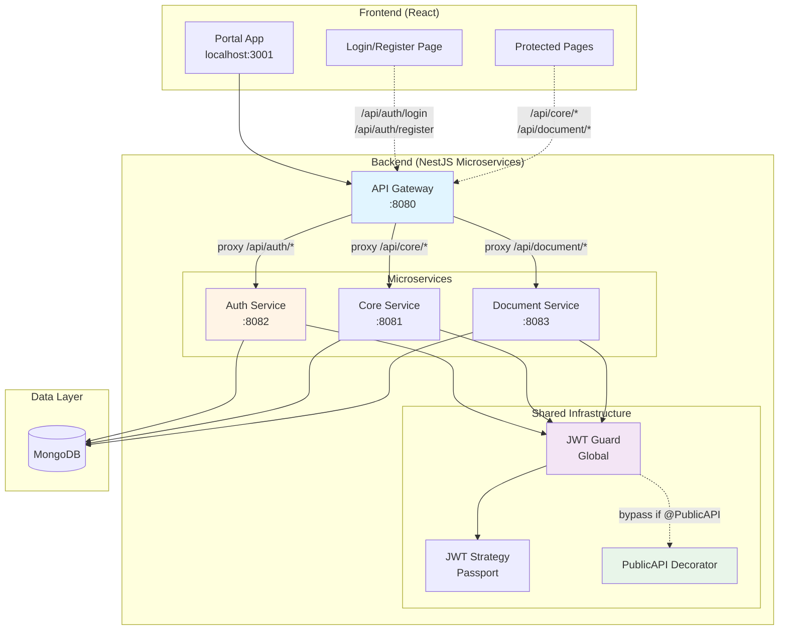
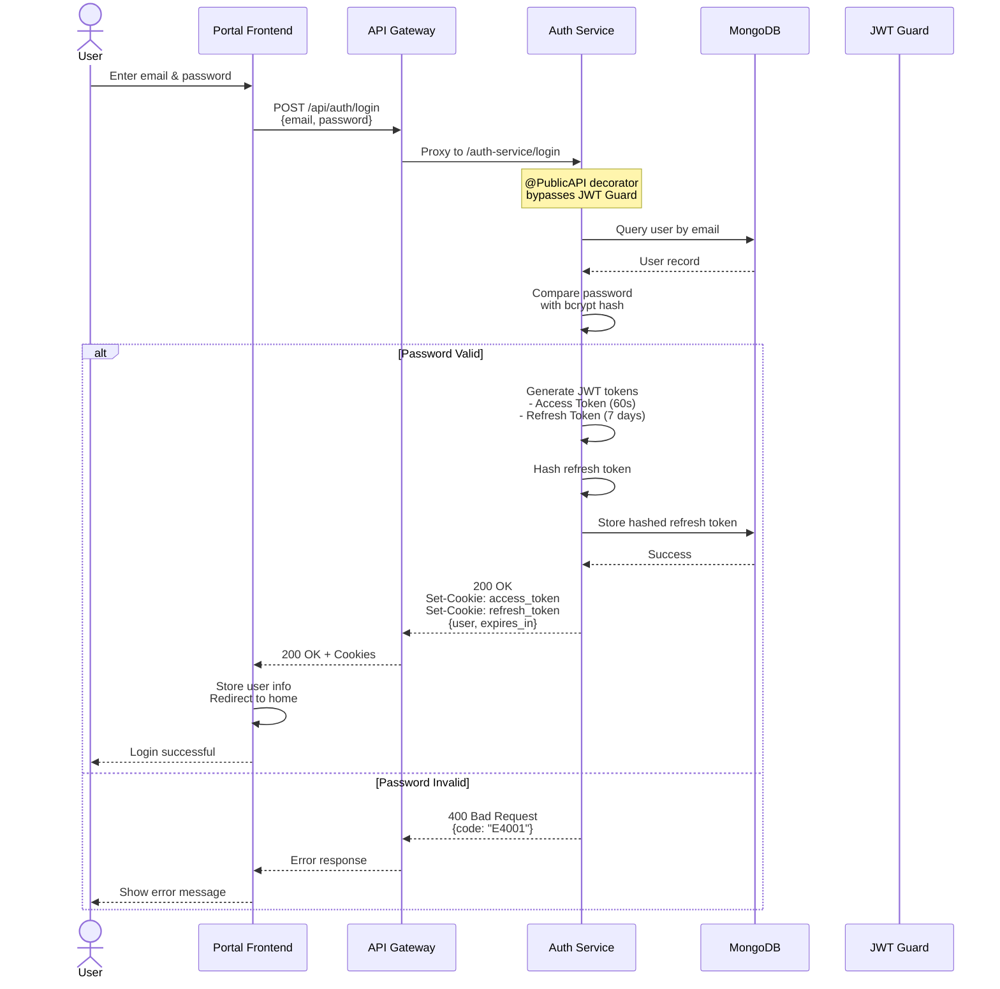
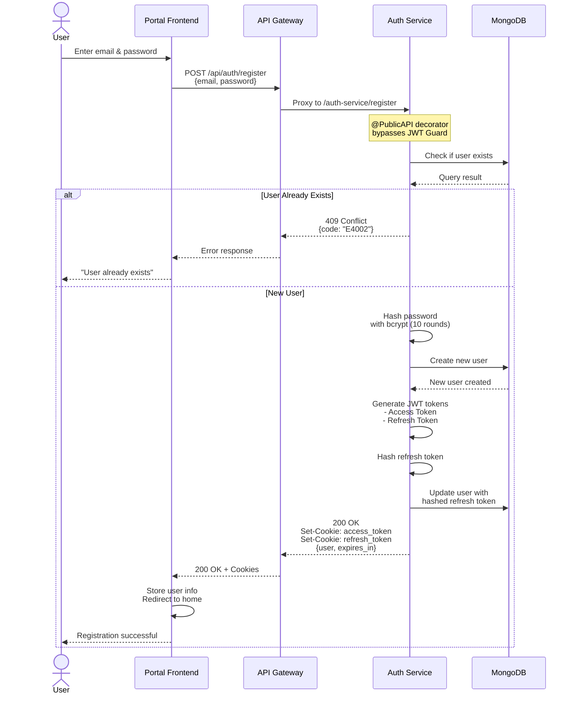
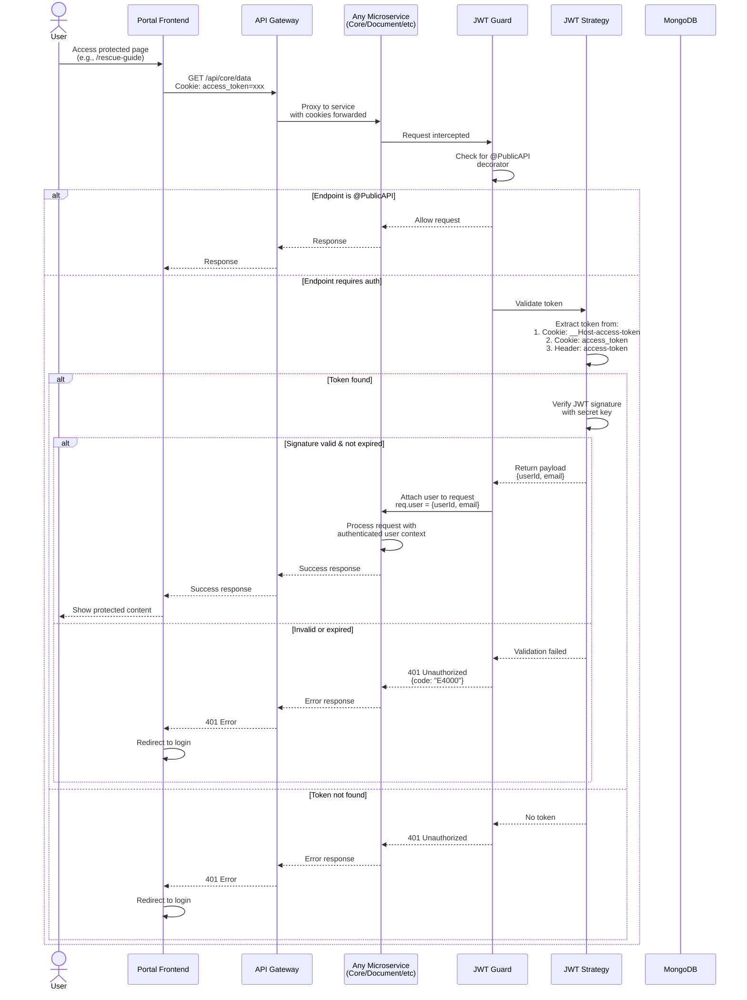
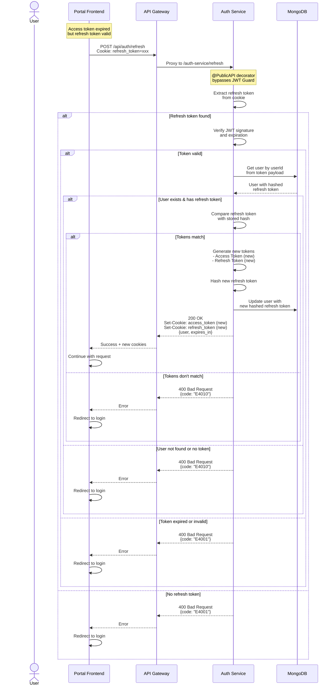
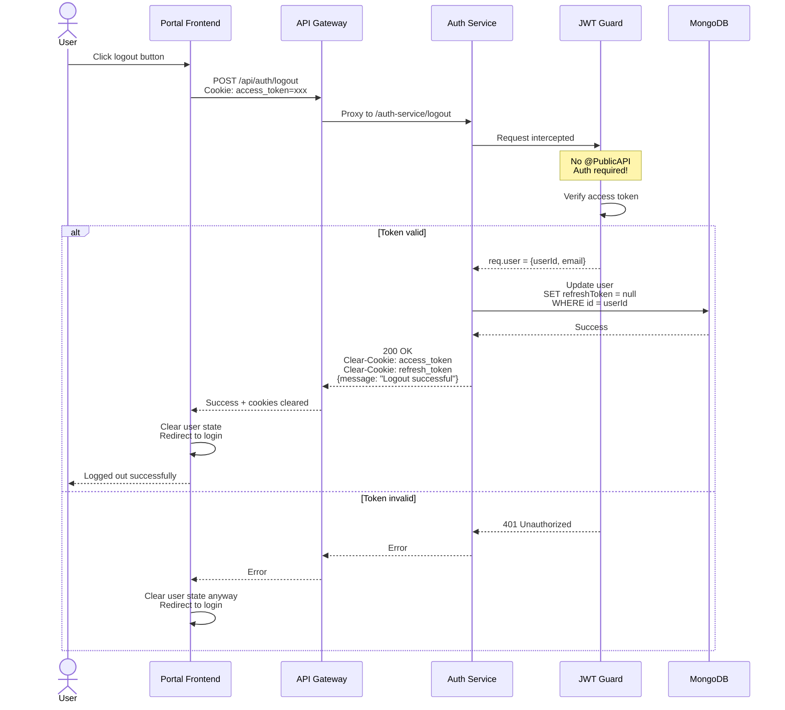
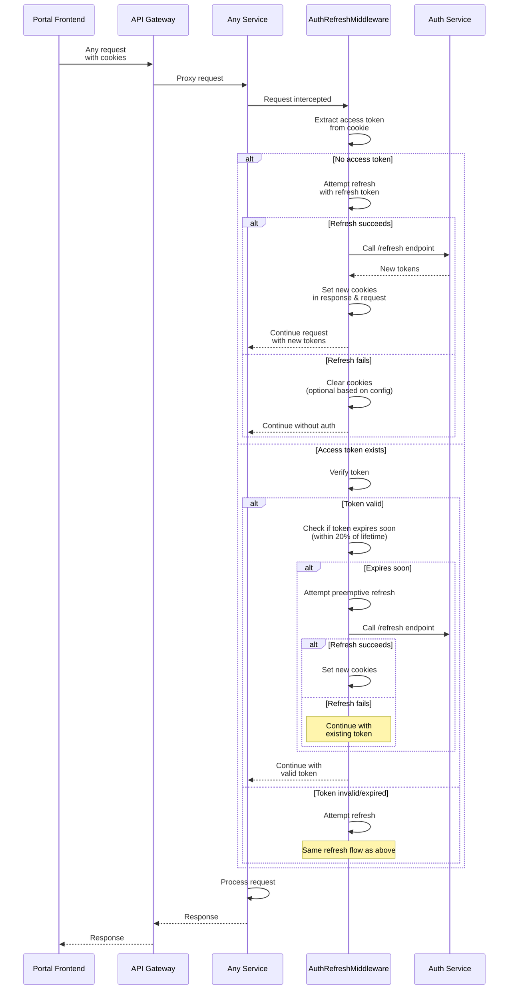

# Authentication & Authorization Architecture

## 📋 Overview

PawHaven implements a secure, cookie-based JWT authentication system with multiple microservices architecture. The authentication flow is centered around:

- **JWT tokens** stored in secure HTTP-only cookies
- **API Gateway** for centralized request routing and validation
- **Auth Service** dedicated to authentication operations
- **Global JWT Guards** for automatic token verification across all microservices
- **Public API decorators** for bypassing authentication on specific endpoints

---

## 🏗️ System Architecture



---

## 🔐 Authentication Flow

### 1. User Login Flow



**Key Components:**

1. **User Input**: Email and password entered in React form component with validation
2. **Request Route**: `POST /api/auth/login` → Gateway (`/api/auth/*`) → Auth Service (`/auth-service/login`)
3. **@PublicAPI Decorator**: Marks the endpoint as public, bypassing JWT Guard
4. **Password Verification**: Uses bcrypt to compare plain password with stored hash
5. **Token Generation**:
   - Access token (JWT): Contains `{userId, email}`, expires in 60 seconds
   - Refresh token (JWT): Contains `{userId}`, expires in 7 days
6. **Cookie Configuration**:
   - `access_token` or `__Host-access-token` (production)
   - `httpOnly: true`, `secure: true` (production), `sameSite: 'lax'` (access) / `'strict'` (refresh)
7. **Refresh Token Storage**: Hashed with bcrypt and stored in MongoDB for later verification

---

### 2. User Registration Flow



**Key Components:**

1. **Duplicate Check**: Query MongoDB to ensure email uniqueness
2. **Password Hashing**: bcrypt with 10 salt rounds
3. **User Creation**: Store user with hashed password in MongoDB
4. **Automatic Login**: Generate tokens immediately after registration
5. **Same Token Flow**: Registration uses identical token generation as login

---

### 3. JWT Token Verification Flow



**Key Components:**

1. **Global JWT Guard**: Registered globally in all microservices via `@pawhaven/backend-core`
2. **Token Extraction Priority**:
   - Cookie: `__Host-access-token` (production, secure prefix)
   - Cookie: `access_token` (development)
   - Header: `access-token` (fallback for API clients)
3. **Reflector Pattern**: Uses NestJS Reflector to check if endpoint has `@PublicAPI()` decorator
4. **Passport Strategy**: JWT validation delegated to passport-jwt
5. **Request Augmentation**: Validated user info attached to `request.user` for downstream use
6. **Automatic Protection**: All routes protected by default unless marked with `@PublicAPI()`

---

### 4. Token Refresh Flow



**Key Components:**

1. **Automatic Refresh**: Backend middleware (`AuthRefreshMiddleware`) detects token expiration/near-expiration
2. **Token Rotation**: Both access and refresh tokens are regenerated on each refresh
3. **Refresh Token Validation**:
   - JWT signature and expiration check
   - Database lookup for user
   - bcrypt comparison with stored hash
4. **Security**: Old refresh token is invalidated by storing new hash

---

### 5. User Logout Flow



**Key Components:**

1. **Protected Endpoint**: Logout requires valid access token (no `@PublicAPI`)
2. **Token Invalidation**: Sets `refreshToken = null` in database
3. **Cookie Clearing**: Response includes `Clear-Cookie` headers for both tokens
4. **Immediate Effect**: User cannot use refresh token to get new access token
5. **Client-side Cleanup**: Frontend clears local user state and redirects

---

### 6. Auth Refresh Middleware Flow



**Key Components:**

1. **Preemptive Refresh**: Automatically refreshes tokens before expiration (proactive, not reactive)
2. **Refresh Window Calculation**:
   - Triggers when remaining time ≤ 20% of token lifetime
   - Example: 60s token → refresh at ≤12s remaining
   - Fallback: 5 minutes if token lifetime unavailable
3. **Dual Cookie Update**: Updates both response (for client) and request (for downstream handlers) objects
   - `setAuthCookies(res)` → Response headers
   - `setAuthCookiesOnRequest(req)` → Request object
   - New tokens immediately available to JWT Guard/Strategy in same cycle
4. **Conditional Cookie Clearing**:
   - **No access token** + refresh fails → Clear cookies
   - **Valid token expiring soon** + refresh fails → **Keep** existing token (graceful degradation)
   - Prevents unnecessary logouts when token still valid
5. **Seamless UX**: User never experiences token expiration during active session
6. **Silent Refresh**: All refresh operations transparent to user (no UI interruption)

---

## 🧩 Component Details

### API Gateway

**Location**: `apps/backend/gateway`

**Responsibilities**:

- Centralized entry point for all client requests
- Routes requests to appropriate microservices based on URL prefix
- Forwards cookies and headers to downstream services
- Adds trace ID for request tracking

**Route Mapping**:

```yaml
/api/auth/*     → Auth Service    (localhost:8082)
/api/core/*     → Core Service    (localhost:8081)
/api/document/* → Document Service (localhost:8083)
```

**Configuration**:

- Path rewrite: `/api/auth/login` → `/auth-service/login`
- CORS: Allows credentials, configured origins
- Proxy: http-proxy-middleware with custom router

---

### Auth Service

**Location**: `apps/backend/auth-service`

**Endpoints**:
| Method | Path | Auth | Description |
|--------|------|------|-------------|
| POST | /auth-service/login | Public | User login with email/password |
| POST | /auth-service/register | Public | User registration |
| POST | /auth-service/refresh | Public | Refresh access token |
| GET | /auth-service/verify | Protected | Verify access token validity |
| POST | /auth-service/logout | Protected | User logout |

**Token Configuration**:

```typescript
tokenConfig: {
  expiresIn: {
    access: 60,        // 60 seconds
    refresh: 604800    // 7 days
  },
  maxAge: {
    refresh: 604800000 // 7 days in milliseconds
  }
}
```

**Cookie Configuration**:

```typescript
cookieConfig: {
  names: {
    access: '__Host-access-token' (prod) | 'access_token' (dev),
    refresh: '__Host-refresh-token' (prod) | 'refresh_token' (dev)
  },
  sameSite: {
    access: 'lax',     // Allows cross-site GET requests
    refresh: 'strict'  // Must be same-site
  },
  baseOptions: {
    httpOnly: true,    // Prevents XSS attacks
    secure: true,      // HTTPS only (production)
    path: '/'
  }
}
```

---

### JWT Guard (Global Protection)

**Location**: `packages/backend-core/dynamicModules/jwt/JWT.guard.ts`

**Registration**: Automatically applied to all microservices via SharedModule

**Behavior**:

1. Intercepts all incoming requests
2. Checks if endpoint has `@PublicAPI()` decorator
3. If public → allows request immediately
4. If protected → delegates to JwtStrategy for validation
5. On success → attaches user to `request.user`
6. On failure → throws 401 Unauthorized

**Code Flow**:

```typescript
canActivate(context) {
  // Check for @PublicAPI decorator
  if (isPublicAPI) return true;

  // Delegate to passport JWT strategy
  return super.canActivate(context);
}

handleRequest(err, user) {
  if (err || !user) {
    throw new UnauthorizedException();
  }
  // Attach user to request
  req.user = user;
  return user;
}
```

---

### JWT Strategy

**Location**: `packages/backend-core/dynamicModules/jwt/JWT.strategy.ts`

**Configuration**:

- **Secret**: Loaded from environment config (`auth.jwtSecret`)
- **Token Extraction**:
  1. Cookie: `__Host-access-token` (production)
  2. Cookie: `access_token` (development)
  3. Header: `access-token` (fallback)

**Validation**:

```typescript
async validate(payload) {
  return {
    userId: payload.userId,
    email: payload.email
  };
}
```

Returns user info on successful validation, which is attached to request by JWT Guard.

---

### PublicAPI Decorator

**Location**: `packages/backend-core/decorators/publicAPI.decorator.ts`

**Purpose**: Marks endpoints that should bypass JWT authentication

**Usage**:

```typescript
@PublicAPI()
@Post('/login')
async login() {
  // No authentication required
}
```

**Implementation**:

```typescript
export const PublicAPI = () =>
  SetMetadata(commonDecoratorsKeys.publicAPI, true);
```

Uses NestJS metadata system to flag endpoints for JWT Guard to skip.

---

### Auth Refresh Middleware

**Location**: `apps/backend/auth-service/src/modules/Auth/auth-refresh.middleware.ts`

**Purpose**: Automatically refresh tokens before they expire to provide seamless user experience

**Configuration**:

- **Refresh Window Calculation**:
  - Primary: 20% of token lifetime (`Math.floor(tokenLifetimeSeconds * 0.2)`)
  - Fallback: 5 minutes (300 seconds) if token lifetime unavailable
  - Minimum: 1 second (enforced via `Math.max(1, ...)`)
  - Example: For 60s access token → refresh when ≤12s remaining
- **Triggers**:
  - No access token present
  - Access token expired
  - Access token expires within refresh window

**Detailed Behavior Flow**:

1. **Token Extraction**: Reads access token from request cookies/headers
2. **Token Verification**:
   - Calls `authService.verifyToken()`
   - Returns `null` on failure (no error thrown)
3. **Expiration Check**: Compares `payload.exp` with current timestamp
4. **Conditional Refresh Decision**:
   - **Scenario A - No access token**: Attempt refresh immediately
   - **Scenario B - Valid token expiring soon**: Preemptive refresh
   - **Scenario C - Invalid/expired token**: Attempt refresh as recovery
5. **Refresh Execution**:
   - Extracts refresh token from request
   - Calls `authService.refresh(refreshToken)`
   - On success: Updates both response and request objects
   - On failure: Conditionally clears cookies (see below)
6. **Cookie Update Strategy**:
   - `setAuthCookies(res, result)` → Sets response headers for client
   - `setAuthCookiesOnRequest(req, result)` → Updates request object for downstream handlers
   - Ensures JWT Guard/Strategy can immediately use new tokens in same request cycle

**Conditional Cookie Clearing Strategy**:

| Scenario            | Access Token Status   | Refresh Fails | Action                                                         |
| ------------------- | --------------------- | ------------- | -------------------------------------------------------------- |
| No access token     | Not present           | ❌            | Clear cookies (`clearCookiesOnFailure: true`)                  |
| Token expiring soon | Valid but near expiry | ❌            | **Keep** existing valid token (`clearCookiesOnFailure: false`) |
| Token expired       | Invalid               | ❌            | Clear cookies (`clearCookiesOnFailure: true`)                  |

**Rationale**: If user has a still-valid access token, keep it even if refresh fails. This allows graceful degradation instead of immediate logout.

**Key Implementation Details**:

```typescript
// Preemptive refresh logic
private shouldRefreshSoon(payload: JwtVerifyInfo): boolean {
  const remainingSeconds = payload.exp - Math.floor(Date.now() / 1000);
  const refreshWindowSeconds = this.getRefreshWindowSeconds(payload);
  return remainingSeconds <= refreshWindowSeconds; // Refresh if ≤20% lifetime
}

// Dynamic window calculation
private getRefreshWindowSeconds(payload: JwtVerifyInfo): number {
  const tokenLifetimeSeconds = payload.exp - payload.iat;
  return Math.max(1, Math.floor(tokenLifetimeSeconds * 0.2));
}
```

**Benefits**:

- **Seamless UX**: Users never experience mid-operation token expiration
- **Preemptive Refresh**: Refreshes before expiration (not reactive)
- **Graceful Degradation**: Keeps valid tokens even if refresh fails
- **Reduced Failed Requests**: Tokens always fresh during active sessions
- **Immediate Availability**: New tokens usable within same request cycle

---

## 🔒 Security Considerations

### 1. Cookie Security

| Feature          | Value                                 | Purpose                                     |
| ---------------- | ------------------------------------- | ------------------------------------------- |
| `httpOnly`       | true                                  | Prevents JavaScript access (XSS protection) |
| `secure`         | true (prod)                           | HTTPS-only transmission (MITM protection)   |
| `sameSite`       | 'lax' (access)<br/>'strict' (refresh) | CSRF protection                             |
| `__Host-` prefix | production                            | Ensures secure, domain-bound cookies        |
| `path`           | '/'                                   | Limits cookie scope                         |

### 2. Token Storage

**✅ Secure Approach (Current)**:

- Access token in HTTP-only cookie
- Refresh token in HTTP-only cookie (hashed in DB)
- Not accessible via JavaScript

**❌ Insecure Alternatives** (NOT used):

- localStorage (vulnerable to XSS)
- sessionStorage (vulnerable to XSS)
- JavaScript-accessible cookies

### 3. Refresh Token Security

- **Hashed Storage**: Refresh tokens stored as bcrypt hash in MongoDB
- **Token Rotation**: New refresh token generated on each refresh
- **Invalidation**: Setting `refreshToken = null` immediately invalidates all sessions
- **Single Use**: Each refresh token can only be used once (rotation invalidates old)

### 4. Password Security

- **Algorithm**: bcrypt with 10 salt rounds
- **Never Stored Plain**: Only hashes stored in database
- **Comparison**: Uses bcrypt's constant-time comparison to prevent timing attacks

### 5. Token Expiration Strategy

**Access Token (60s)**:

- Short lifetime limits exposure window
- If compromised, expires quickly
- Requires frequent refresh (handled automatically)

**Refresh Token (7 days)**:

- Longer lifetime for better UX
- Stored securely in HTTP-only cookie
- Can be revoked server-side

### 6. CORS Configuration

```yaml
cors:
  origin: ['http://localhost:3001'] # Specific origins only
  credentials: true # Allow cookies
  allowedHeaders: [...] # Whitelist headers
  methods: ['GET', 'POST', 'PUT', 'DELETE', 'PATCH', 'OPTIONS']
```

### 7. Error Handling

**Generic Error Messages**:

- "Invalid credentials" (login) - doesn't reveal if email exists
- "Unauthorized" (401) - doesn't specify reason
- Detailed errors logged server-side only

**Error Codes**: Standardized in `httpBusinessMappingCodes`

- `E4000`: Unauthorized
- `E4001`: Invalid credentials
- `E4002`: User already exists
- `E4010`: Invalid refresh token

---

## 🚀 Microservices JWT Verification in Monorepo

### Shared Infrastructure Pattern

All microservices in the monorepo share authentication infrastructure via `@pawhaven/backend-core` package:

```
@pawhaven/backend-core
├── dynamicModules/
│   ├── shared.module.ts          # Exports shared JWT modules
│   └── jwt/
│       ├── JWT.guard.ts           # Global JWT guard
│       ├── JWT.strategy.ts        # Token validation strategy
│       └── JWT.module.ts          # JWT module configuration
├── decorators/
│   └── publicAPI.decorator.ts    # @PublicAPI() decorator
└── constants/
    └── httpBusinessMappingCodes.ts # Standardized error codes
```

### Integration in Each Microservice

**Step 1**: Install shared package

```json
{
  "dependencies": {
    "@pawhaven/backend-core": "workspace:*"
  }
}
```

**Step 2**: Import SharedModule in app module

```typescript
import { SharedModule } from '@pawhaven/backend-core';

@Module({
  imports: [
    SharedModule.forRoot({
      jwtSecret: process.env.JWT_SECRET,
      // ... other config
    }),
  ],
})
export class AppModule {}
```

**Step 3**: Use JWT Guard (automatic) or @PublicAPI (explicit)

```typescript
// Protected endpoint (default)
@Get('/protected')
async getProtectedData(@Req() req: Request) {
  const user = req.user; // Automatically attached by JWT Guard
  return { userId: user.userId };
}

// Public endpoint (opt-out)
@PublicAPI()
@Post('/public')
async publicEndpoint() {
  return { message: 'No auth required' };
}
```

### Benefits of Shared Infrastructure

1. **Consistency**: All services use identical JWT validation logic
2. **DRY Principle**: No code duplication across services
3. **Easy Updates**: Change JWT logic once, affects all services
4. **Type Safety**: Shared TypeScript types across frontend and backend
5. **Centralized Config**: JWT secret and config managed in one place

---

## 📊 Data Flow Summary

### Login/Register

```
User Input → Portal → Gateway → Auth Service → MongoDB
                                       ↓
                      Generate JWT + Hash Refresh Token
                                       ↓
                      Store Hashed Token in DB
                                       ↓
             Set HTTP-only Cookies (access + refresh)
                                       ↓
                      Portal ← Gateway ← Auth Service
```

### Protected Request

```
Portal (with cookies) → Gateway → Microservice → JWT Guard
                                                     ↓
                                        Check @PublicAPI decorator
                                                     ↓
                                   If protected: JWT Strategy
                                                     ↓
                                   Extract token from cookie
                                                     ↓
                                   Verify signature & expiration
                                                     ↓
                        Attach req.user = {userId, email}
                                                     ↓
                        Process request with user context
                                                     ↓
                        Portal ← Gateway ← Microservice
```

### Token Refresh

```
Portal → Gateway → Auth Service (with refresh token cookie)
                         ↓
              Verify refresh token JWT
                         ↓
              Query user from DB by userId
                         ↓
              Compare refresh token with stored hash
                         ↓
              Generate new access + refresh tokens
                         ↓
              Hash new refresh token
                         ↓
              Update DB with new hash
                         ↓
              Set new cookies in response
                         ↓
              Portal ← Gateway ← Auth Service
```

### Logout

```
Portal → Gateway → Auth Service (with access token)
                         ↓
              JWT Guard validates access token
                         ↓
              Set refreshToken = null in DB
                         ↓
              Clear cookies in response
                         ↓
              Portal ← Gateway ← Auth Service
                         ↓
              Clear local state & redirect to login
```

---

## 🔄 Frontend Integration

### Login Component

**Location**: `apps/frontend/portal/src/features/Auth/Login/index.tsx`

**Features**:

- React Hook Form with Zod validation
- Password visibility toggle (Eye/EyeOff icons from lucide-react)
- Loading state during authentication
- Automatic redirect on success

**API Call**:

```typescript
const { mutate } = useLogin();

mutate(
  { email, password },
  {
    onSuccess: () => {
      // Cookies set automatically by server
      navigate('/');
    },
  },
);
```

### Auth State Management

- **Token Storage**: HTTP-only cookies (managed by browser)
- **User State**: Redux store or React Query cache
- **Persistence**: React Query with localStorage persister

### Protected Routes

```typescript
<Route
  element={<AuthGuard />}
  handle={{ isRequireUserLogin: true }}
>
  <Route path="/protected" element={<ProtectedPage />} />
</Route>
```

**AuthGuard** checks for valid user session and redirects to login if missing.

---

## 📖 Best Practices

### For Backend Developers

1. **Always use `@PublicAPI()` explicitly** for public endpoints
2. **Never log tokens** or sensitive information
3. **Validate all inputs** using DTOs with Zod schemas
4. **Use `req.user`** to access authenticated user info
5. **Handle errors consistently** with standardized error codes

### For Frontend Developers

1. **Never store tokens in localStorage** or accessible variables
2. **Let cookies handle token storage** automatically
3. **Implement proper error handling** for 401 responses
4. **Use loading states** during authentication operations
5. **Clear user state on logout** and redirect to login

### For DevOps

1. **Always use HTTPS** in production (enforces `secure` cookies)
2. **Set strong JWT secrets** (minimum 32 characters, random)
3. **Configure CORS** carefully (specific origins, not `*`)
4. **Monitor failed auth attempts** for security threats
5. **Rotate JWT secrets periodically** (with blue-green deployment)

---

## 🧪 Testing Authentication

### Manual Testing

**Login**:

```bash
curl -X POST http://localhost:8080/api/auth/login \
  -H "Content-Type: application/json" \
  -d '{"email":"test@example.com","password":"password123"}' \
  -v
```

Expected: `Set-Cookie` headers with `access_token` and `refresh_token`

**Protected Endpoint**:

```bash
curl http://localhost:8080/api/core/bootstrap \
  -H "Cookie: access_token=<token>" \
  -v
```

Expected: 200 OK with data, or 401 if token invalid

**Logout**:

```bash
curl -X POST http://localhost:8080/api/auth/logout \
  -H "Cookie: access_token=<token>" \
  -v
```

Expected: `Clear-Cookie` headers

### Automated Testing

**Unit Tests**: Mock JWT validation in services

```typescript
jest.mock('@nestjs/jwt');
jwtService.verifyAsync.mockResolvedValue({ userId: '123' });
```

**Integration Tests**: Use Supertest with cookie jar

```typescript
const response = await request(app.getHttpServer())
  .post('/auth/login')
  .send({ email, password });

const cookies = response.headers['set-cookie'];

await request(app.getHttpServer()).get('/protected').set('Cookie', cookies);
```

---

## 🛠️ Troubleshooting

### "401 Unauthorized" on all requests

**Causes**:

- JWT secret mismatch between services
- Token expired
- Cookie not sent (CORS issue)

**Solutions**:

- Verify `JWT_SECRET` environment variable is identical across all services
- Check browser DevTools → Network → Cookies
- Ensure `credentials: true` in CORS config

### Tokens not refreshing automatically

**Causes**:

- AuthRefreshMiddleware not registered
- Refresh token expired or invalid
- Database refresh token hash mismatch

**Solutions**:

- Check middleware is applied in each service
- Verify refresh token TTL (7 days)
- Debug `comparePassword` result for refresh token

### "User already exists" on registration

**Cause**: Email already registered

**Solution**: Use unique email or reset database

### Cookies not sent cross-origin

**Causes**:

- Missing `credentials: 'include'` in fetch
- CORS origin mismatch
- SameSite attribute too restrictive

**Solutions**:

- Add `credentials: 'include'` to axios/fetch config
- Verify `CORS.origin` includes frontend URL
- Use `sameSite: 'lax'` for access token

---

## 📚 Related Documentation

- [Project Architecture](./architecture_design.md) - Overall system design
- [API Documentation](http://localhost:8080/api-docs) - Swagger UI (when running)
- [Environment Setup](./project_structure.md#setup) - Local development setup

---

## 🤝 Contributing

When modifying authentication logic:

1. Update this documentation
2. Add/update unit tests
3. Test all authentication flows manually
4. Verify cookie security settings
5. Check CORS configuration
6. Update frontend integration if needed

---

**Last Updated**: March 2026  
**Maintained by**: PawHaven Team
